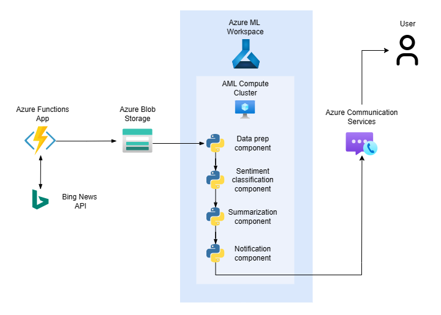

A pipeline to automatically retrieves data from the Bing News API about various stocks that I own using a time triggered Azure Function. The collected news articles are enriched by their full text and then stored in Azure Blob Storage. Every working day, an Azure ML Compute Cluster is spun up to then execute a pipeline, which takes in the collected news articles and classifies them by their sentiment, summarizes them, and finally triggers the Azure Communication Service and sends out the results of the pipeline.

There are two big upsides of using Azure ML Pipelines for this task. 
- AML Clusters can scale up and down as needed, allowing you to very cheaply book VMs with lots of power. 
- The components of the pipeline can be expanded or changed without the need to touch the rest of the pipeline. 

The sentiment classification is done with a distilbert model, which I finetuned with 50.000 news articles for Kern AI. https://huggingface.co/KernAI/stock-news-distilbert
Summaries are generated by a Pegasus model for financial summarization. https://huggingface.co/human-centered-summarization/financial-summarization-pegasus

